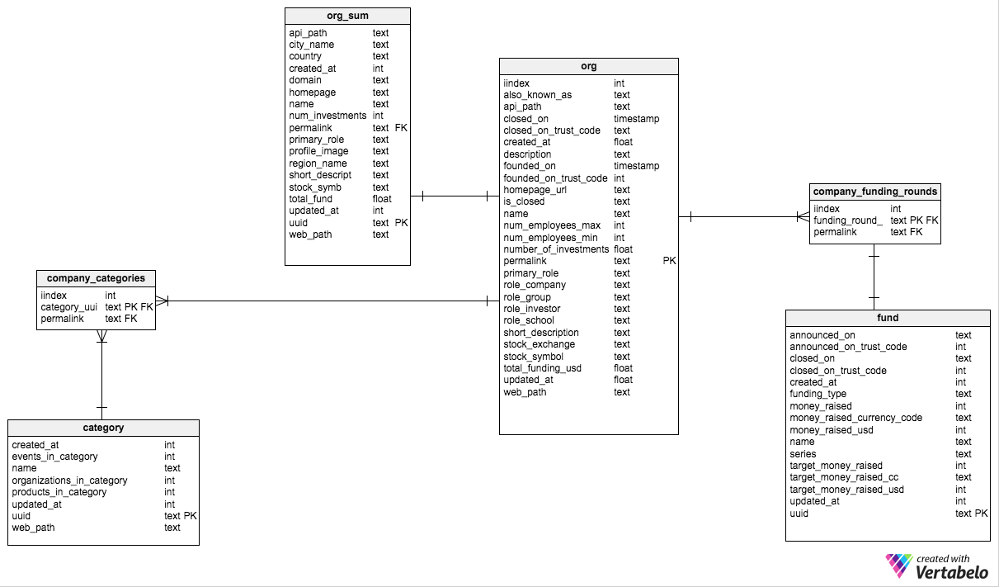

# CrunchBase Data Collection
CrunchBase provides a REST API to access their database. I collected data on:
* Companies (335,252 companies, 113.9 MB)
* Categories (882 categories, 132 KB)
* Funding Rounds (15,727 funding rounds, 4 MB) 

I used Python’s urllib2 module to send GET requests to the CrunchBase API to get information from their database. CrunchBase provides Endpoints that I could query for information: 
* “Collection” Endpoints: used to retrieve an entire set of data
* “Item Details”: used to retrieve more detailed information about a specific item
 	
Although I wanted basic information for all companies in CrunchBase’s database, I was interested in getting more detailed information about companies in Silicon Valley. I sent Get requests to the Collection Endpoint for Companies (“Organization Summary”) to get basic information about all the companies in CrunchBase’s database. With that list, I could narrow down the list to companies that are located in Silicon Valley. I then sent requests to the “Item Details” Endpoint for Companies (“Organization”) to get more detailed information about the companies that are in Silicon Valley.

The scripts output data into comma-separated files. We then loaded these files into PostgreSQL and into R. In PostgreSQL, I could run SQL queries on the data. Using R, I could perform visualizations of the data.

